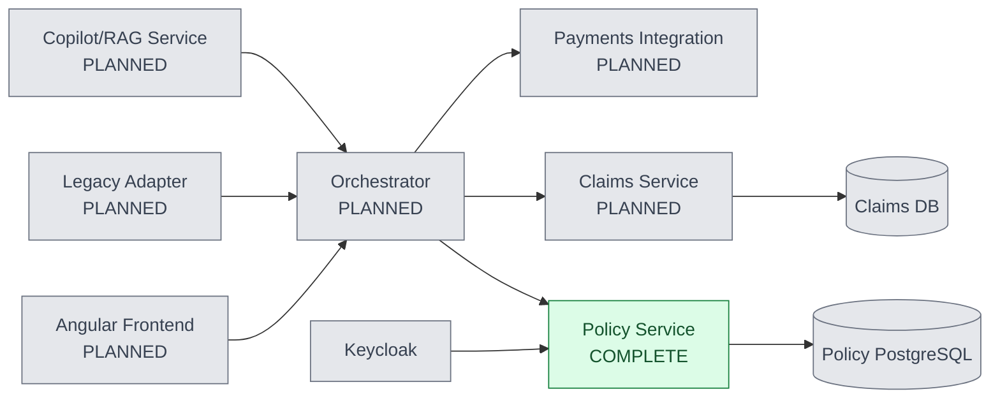

# Insurance Claims Orchestration Platform

[](https://github.com/Charan-Hari/insurance-claims-orchestration-platform/actions/workflows/policy-service-ci.yml)

An insurance claims orchestration platform built with spec-driven development (GitHub Spec-Kit), where AI coding agents direct implementation under human review.

## Why this exists

This project demonstrates enterprise-grade delivery practices for AI-assisted engineering: specifications come before code, constitution-enforced quality gates guide implementation, and every AI-generated change is reviewed by a human before commit. State-changing policy operations also maintain an auditable trail.

## Current Status

| Service | Status | Evidence |
| --- | --- | --- |
| Policy Service | **COMPLETE** | All 3 user stories, 7 functional requirements, 21/21 tests passing, Keycloak RBAC, atomic audit trail, structured logging, Docker Compose runtime |
| Claims Service | **PLANNED** | Not implemented |
| Orchestrator | **PLANNED** | Not implemented |
| Legacy Adapter | **PLANNED** | Not implemented |
| Payments Integration | **PLANNED** | Not implemented |
| Copilot/RAG Service | **PLANNED** | Not implemented |
| Angular Frontend | **PLANNED** | Not implemented |

The [Policy Service specification](specs/001-policy-service-management/) is the reference example of the complete Spec-Kit workflow, including [spec.md](specs/001-policy-service-management/spec.md), [plan.md](specs/001-policy-service-management/plan.md), [tasks.md](specs/001-policy-service-management/tasks.md), and the pinned [OpenAPI contract](specs/001-policy-service-management/contracts/policy-api.yaml).

## Architecture



The multi-service monorepo keeps services independently deployable while sharing one delivery process, constitution, and CI boundary.

## Quickstart

[](https://codespaces.new/Charan-Hari/insurance-claims-orchestration-platform?quickstart=1)

Clone the repository or open it in GitHub Codespaces, then start the local Policy Service stack:

```sh
git clone https://github.com/Charan-Hari/insurance-claims-orchestration-platform.git
cd insurance-claims-orchestration-platform
cp .env.example .env
docker compose up --build
```

The stack runs PostgreSQL 16, Keycloak in development mode, and the Policy Service. The policy container applies Alembic migrations before starting Uvicorn. For full Keycloak realm, client, role, and JWT setup, see [services/policy/README.md](services/policy/README.md).

With a valid Keycloak token in `TOKEN`, the three primary policy operations are:

```sh
# Create a policy application
curl -X POST http://localhost:8000/policies \
	-H "Authorization: Bearer $TOKEN" \
	-H 'Content-Type: application/json' \
	-d '{"policyholder_id":"11111111-1111-1111-1111-111111111111","coverage_type":"property","coverage_limits":{"dwelling":250000},"effective_date":"2026-10-01","expiry_date":"2027-10-01","premium_amount":"1200.00"}'

# Retrieve a policy
curl http://localhost:8000/policies/POLICY_ID \
	-H "Authorization: Bearer $TOKEN"

# Transition a policy status with an underwriter or admin token
curl -X PATCH http://localhost:8000/policies/POLICY_ID/status \
	-H "Authorization: Bearer $TOKEN" \
	-H 'Content-Type: application/json' \
	-d '{"status":"pending_underwriting"}'
```

## Delivery Process

Feature work follows the Spec-Kit workflow: **constitution -> specify -> clarify -> plan -> tasks -> implement**, with tests and review gates around implementation. Read the [project constitution](.specify/memory/constitution.md) for the security, audit, resilience, integration, and human-review requirements.

Every AI-generated change was reviewed before commit. The [commit history](https://github.com/Charan-Hari/insurance-claims-orchestration-platform/commits/main/) contains the implementation sequence and detailed rationale in the commit messages.

## Tech Stack

| Service | Language | Framework / Runtime | Data / Integration | Status |
| --- | --- | --- | --- | --- |
| Policy Service | Python 3.12 | FastAPI, SQLAlchemy 2.0 async, Alembic | PostgreSQL 16, Keycloak | Complete |
| Claims Service | Python 3.12 | FastAPI | PostgreSQL 16 | Planned |
| Orchestrator | Python 3.12 | FastAPI | Service APIs, saga coordination | Planned |
| Legacy Adapter | Python 3.12 | FastAPI, adapter clients | Legacy feeds and service APIs | Planned |
| Payments Integration | TypeScript | Node.js integration service | Payment provider API | Planned |
| Copilot/RAG Service | Python 3.12 | FastAPI, RAG tooling | Vector/document stores | Planned |
| Angular Frontend | TypeScript | Angular | Policy and claims APIs | Planned |

## Demo

TODO: Add a recorded terminal walkthrough using asciinema or a GIF showing the Compose stack, Keycloak JWT flow, policy lifecycle, and audit record.

## License

This project is licensed under the [MIT License](LICENSE).