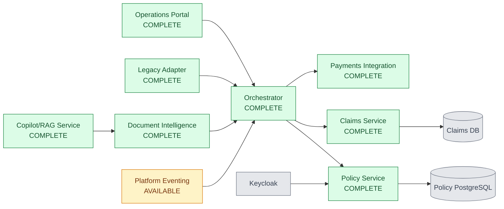
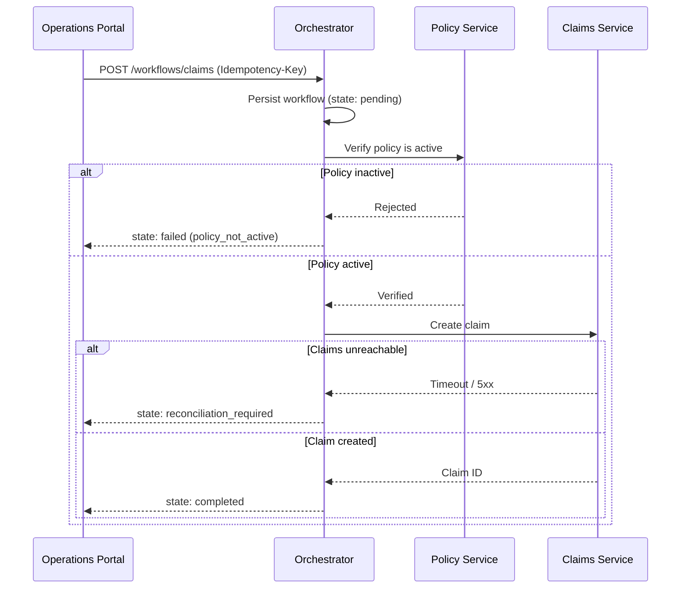
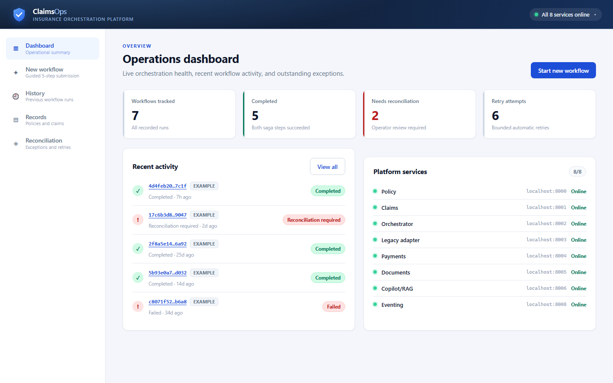
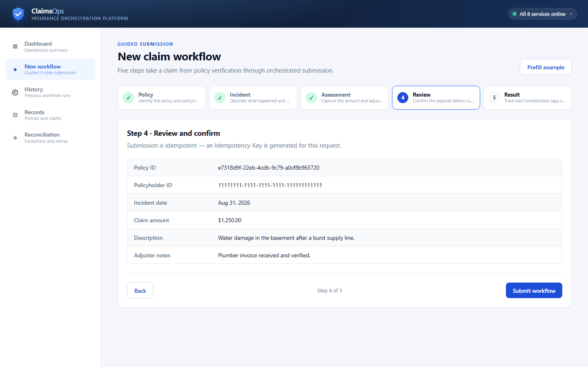
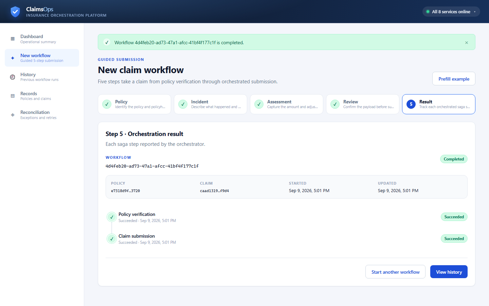
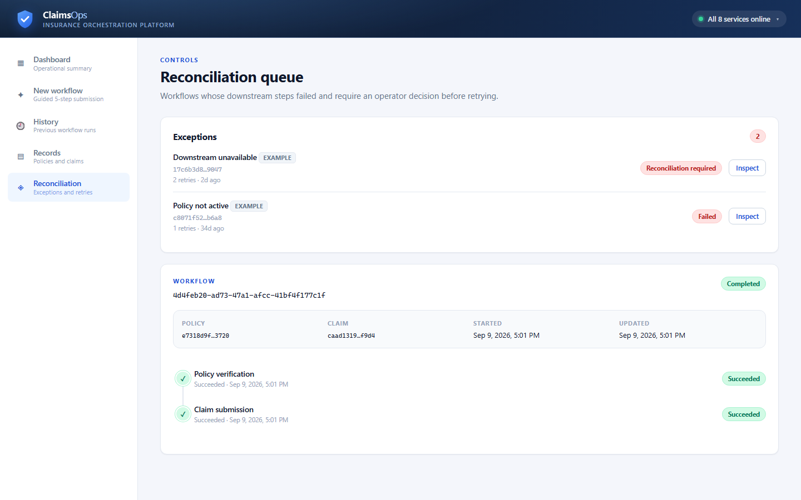

# Insurance Claims Orchestration Platform

[](https://github.com/Charan-Hari/insurance-claims-orchestration-platform/actions/workflows/policy-service-ci.yml)
[](https://github.com/Charan-Hari/insurance-claims-orchestration-platform/actions/workflows/claims-service-ci.yml)
[](https://github.com/Charan-Hari/insurance-claims-orchestration-platform/actions/workflows/orchestrator-ci.yml)
[](https://github.com/Charan-Hari/insurance-claims-orchestration-platform/actions/workflows/payments-service-ci.yml)
[](https://github.com/Charan-Hari/insurance-claims-orchestration-platform/actions/workflows/python-services-ci.yml)
[](https://github.com/Charan-Hari/insurance-claims-orchestration-platform/actions/workflows/operations-portal-pages.yml)

An insurance claims orchestration platform built with spec-driven development (GitHub Spec-Kit), where AI coding agents direct implementation under human review.

**[▶ Try the live demo](https://charan-hari.github.io/insurance-claims-orchestration-platform/)** — the Operations Console running on bundled sample data, no setup required.


*The Operations Console taking a claim through the guided five-step workflow, then the resulting saga timeline, history, and reconciliation queue. See [docs/demo/](docs/demo/) for full-resolution screenshots.*

## What this platform does

An insurance claim cannot simply be written to a database. It has to be checked against a policy that lives in another system, recorded in a claims ledger, paid through a provider, and evidenced for audit — and any of those steps can fail independently. This platform models that reality.

An operator submits a claim through the Operations Console. The Orchestrator then verifies the policy is active, creates the claim, and reports the outcome of each step. If a downstream service is unavailable partway through, the workflow is parked in a `reconciliation_required` state with its failure category recorded, rather than leaving the system in an ambiguous half-committed condition. An operator can then retry it from the console.

Around that core flow sit the integrations a real enterprise deployment needs: a legacy adapter for claims arriving from older systems, a provider-neutral payments service, document intelligence for evidence handling, and a retrieval service that drafts cited answers while explicitly refusing to adjudicate.

**Engineering properties demonstrated here**

| Concern | How it is addressed |
| --- | --- |
| Distributed consistency | Saga coordination with per-step persistence and an explicit reconciliation state |
| Idempotency | `Idempotency-Key` on every state-changing endpoint; replay returns the original result, changed payloads return `409` |
| Resilience | Timeouts, bounded retries with backoff, and typed error classification on cross-service calls |
| Security | Keycloak SSO, RBAC by role, JWT audience validation, no credentials in source |
| Auditability | Append-only audit trails written in the same transaction as the state change |
| Human-usable identifiers | UUID primary keys keep writes uncoordinated across services, while a `CLM-YYYY-NNNNNN` reference allocated by a Postgres sequence gives operators something speakable |
| Observability | Structured JSON logs with a request ID propagated across service boundaries |
| Supply chain | Secret, static-analysis, and dependency scanning gate every push and run weekly |
| Verification | 100+ automated tests, per-service CI, and live end-to-end evidence captured against the running stack |

## Why this exists

This project demonstrates enterprise-grade delivery practices for AI-assisted engineering: specifications come before code, constitution-enforced quality gates guide implementation, and every AI-generated change is reviewed by a human before commit. State-changing policy operations also maintain an auditable trail.

## Current Status

| Service | Status | Evidence |
| --- | --- | --- |
| Policy Service | **COMPLETE** | All 3 user stories, 7 functional requirements, 21/21 tests passing, Keycloak RBAC, atomic audit trail, structured logging, Docker Compose runtime |
| Claims Service | **COMPLETE** | All 3 user stories, 8 functional requirements, 35/35 tests passing, resilient cross-service call to Policy Service (timeout+retry+backoff), atomic audit trail, structured logging, Docker Compose runtime, verified live end-to-end cross-service proof |
| Orchestrator | **COMPLETE** | Saga workflow across Policy and Claims, idempotent replay, changed-payload conflict detection, bounded retries, reconciliation-required state, workflow audit events, verified live end-to-end run |
| Legacy Adapter | **COMPLETE** | Idempotent legacy claim ingestion, PostgreSQL persistence, Keycloak auth, health/readiness, Docker Compose |
| Payments Integration | **COMPLETE** | Provider-neutral authorize/capture/refund API, idempotency persistence, deterministic local provider, structured logs, Docker runtime |
| Document Intelligence | **COMPLETE** | Secure local document storage, checksum/idempotency, policy-aware search, explainable review, human approval workflow |
| Operations Portal | **COMPLETE** | Guided five-step workflow wizard, live service-health monitoring, persistent workflow history, records lookup, reconciliation queue, public GitHub Pages demo, 36/36 tests passing |
| Copilot/RAG Service | **COMPLETE** | Policy-aware retrieval, cited answer drafts, pluggable generator (offline by default, opt-in hosted LLM with audited degradation), explicit non-adjudication disclaimer, and human approval boundary |
| Platform Eventing | **AVAILABLE** | Isolated PostgreSQL transactional outbox, idempotent append, readiness, and retryable delivery abstraction. Producers are not yet wired into the Policy, Claims, and Orchestrator transactions — see [services/eventing/README.md](services/eventing/README.md) |

### Verified end-to-end evidence

Captured against the full Compose stack running in GitHub Codespaces:

| Behaviour | Verification | Result |
| --- | --- | --- |
| Authentication | Keycloak password grant for `demo-agent` in the `policy` realm | Token issued, RBAC enforced |
| Policy lifecycle | `POST /policies` then `PATCH /policies/{id}/status` | `draft → pending_underwriting → active` |
| Orchestrated workflow | `POST /workflows/claims` | `201` — workflow `completed`, both saga steps `succeeded` |
| Idempotent replay | Same `Idempotency-Key` and payload resubmitted | Same workflow and claim returned, no duplicate created |
| Conflict protection | Same `Idempotency-Key` with a changed payload | `409 Conflict` |
| Unauthenticated access | Request without a valid bearer token | `401 Unauthorized` |

## Architecture



The [Policy Service specification](specs/001-policy-service-management/) is the reference example of the complete Spec-Kit workflow, including [spec.md](specs/001-policy-service-management/spec.md), [plan.md](specs/001-policy-service-management/plan.md), [tasks.md](specs/001-policy-service-management/tasks.md), and the pinned [OpenAPI contract](specs/001-policy-service-management/contracts/policy-api.yaml).

The [Claims Service specification](specs/002-claims-service-management/) follows the same workflow and additionally demonstrates cross-service integration: [spec.md](specs/002-claims-service-management/spec.md), [plan.md](specs/002-claims-service-management/plan.md), [tasks.md](specs/002-claims-service-management/tasks.md), and the pinned [OpenAPI contract](specs/002-claims-service-management/contracts/claims-api.yaml).

The multi-service monorepo keeps services independently deployable while sharing one delivery process, constitution, and CI boundary.

### Claim submission workflow

The Orchestrator coordinates a two-step saga. Each step is persisted, so a partial failure is recoverable rather than silently lost:



A repeated `Idempotency-Key` returns the original workflow instead of creating a duplicate; the same key with a changed payload is rejected with `409 Conflict`. Workflows left in `reconciliation_required` surface in the portal's reconciliation queue with their failure category and an operator retry action.

The Platform Eventing service runs at `http://localhost:8008`; see
[services/eventing/README.md](services/eventing/README.md) for its envelope, schema,
worker adapter, and follow-up integration points.

## Operations Console

The [Operations Portal](apps/operations-portal/) is the human control surface for the platform.

| Capability | Behaviour |
| --- | --- |
| Guided workflow | Five explicit steps — policy, incident, assessment, review, result — with per-step validation and a numbered progress indicator |
| Live service health | Every service `/health` endpoint is polled continuously and reported in the header and on the dashboard |
| Workflow history | Live runs persist across reloads; bundled sample runs are always present so lookups are never empty |
| Records lookup | Policies and claims for a policyholder, served by the Policy and Claims services |
| Reconciliation | Failed and reconciliation-required workflows with failure category, retry count, and an operator retry action |
| Resilience | Request timeouts, generated idempotency keys, typed API errors with request IDs, and full HTML escaping |

<p align="center">
	
	
</p>
<p align="center">
	
	
</p>

### Regenerating the demo assets

The walkthrough is reproducible. Downstream responses are stubbed at the network layer so the recording is deterministic:

```sh
cd apps/operations-portal && npm install && npm run dev -- --port 5199
# in a second shell, from the repository root
node scripts/capture-demo.mjs      # writes screenshots and GIF frames
python scripts/build-demo-gif.py   # assembles docs/demo/operations-portal-demo.gif
```

## Running the platform locally

[](https://codespaces.new/Charan-Hari/insurance-claims-orchestration-platform?quickstart=1)

Clone the repository or open it in GitHub Codespaces, then start the full stack:

```sh
git clone https://github.com/Charan-Hari/insurance-claims-orchestration-platform.git
cd insurance-claims-orchestration-platform
cp .env.example .env
docker compose up --build
```

The stack runs PostgreSQL 16, Keycloak in development mode, Policy Service, Claims Service, Orchestrator, Legacy Adapter, Payments Integration, Document Intelligence, Copilot/RAG, Platform Eventing, and the Operations Portal. Each Python service applies Alembic migrations before starting Uvicorn; local SQLite services use persistent volumes. For full Keycloak realm, client, and JWT setup, see [services/policy/README.md](services/policy/README.md).

Once the stack is healthy, the Operations Console is at **http://localhost:3000** and reports each service's live health in its header.

| Service | URL |
| --- | --- |
| Operations Portal | http://localhost:3000 |
| Policy Service | http://localhost:8000 |
| Claims Service | http://localhost:8001 |
| Orchestrator | http://localhost:8002 |
| Legacy Adapter | http://localhost:8003 |
| Payments Integration | http://localhost:8004 |
| Document Intelligence | http://localhost:8005 |
| Copilot/RAG Service | http://localhost:8006 |
| Platform Eventing | http://localhost:8008 |

With a valid Keycloak token in `TOKEN`, the three primary policy operations are:

```sh
# Create a policy application
curl -X POST http://localhost:8000/policies \
	-H "Authorization: Bearer $TOKEN" \
	-H 'Content-Type: application/json' \
	-d '{"policyholder_id":"11111111-1111-1111-1111-111111111111","coverage_type":"property","coverage_limits":{"dwelling":250000},"effective_date":"2026-10-01","expiry_date":"2027-10-01","premium_amount":"1200.00"}'

# Retrieve a policy
curl http://localhost:8000/policies/POLICY_ID \
	-H "Authorization: Bearer $TOKEN"

# Transition a policy status with an underwriter or admin token
curl -X PATCH http://localhost:8000/policies/POLICY_ID/status \
	-H "Authorization: Bearer $TOKEN" \
	-H 'Content-Type: application/json' \
	-d '{"status":"pending_underwriting"}'
```

## Delivery Process

Feature work follows the Spec-Kit workflow: **constitution -> specify -> clarify -> plan -> tasks -> implement**, with tests and review gates around implementation. Read the [project constitution](.specify/memory/constitution.md) for the security, audit, resilience, integration, and human-review requirements.

Every AI-generated change was reviewed before commit. The [commit history](https://github.com/Charan-Hari/insurance-claims-orchestration-platform/commits/main/) contains the implementation sequence and detailed rationale in the commit messages.

### Continuous integration

Every service is covered by CI on push and pull request. Workflows are path-filtered, so a
change to one service does not rebuild the others.

| Workflow | Covers |
| --- | --- |
| Policy Service CI | `services/policy` |
| Claims Service CI | `services/claims` |
| Orchestrator CI | `services/orchestrator` |
| Payments Service CI | `services/payments` (Node) |
| Python Services CI | `services/copilot-rag`, `document-intelligence`, `eventing`, `legacy-adapter` (matrix) |
| Operations Portal Pages | `apps/operations-portal` — tests gate the GitHub Pages deploy |
| Security Scan | whole repository — secrets, Python static analysis, dependency advisories |

Each Python job installs the service, byte-compiles `src` and `tests`, runs `pytest`, and
fails on whitespace-damaged patches. **No job is given credentials or a hosted API key**:
the suites must pass entirely offline, which keeps CI hermetic and continuously proves the
offline defaults still work.

Security Scan runs on every push and pull request and additionally on a weekly schedule,
because a dependency that is clean today can be disclosed tomorrow without anyone touching
the repository. It gates on three things: `gitleaks` over the **full history**, since a
credential committed and later deleted is still exposed; `bandit` over service sources for
injection, unsafe deserialisation, and weak crypto; and `pip-audit` plus `npm audit` for
known advisories. Dependency auditing is scoped to production dependencies — build-tool
advisories cannot reach a deployed artefact, and failing on them trains reviewers to ignore
the job.

One advisory is accepted rather than fixed, and deliberately so.
**PYSEC-2026-1325** (`ecdsa`, Minerva timing attack on P-256) has **no upstream fix** —
the maintainers consider side-channel resistance out of scope — so there is no version to
upgrade to. It reaches the platform transitively through `python-jose[cryptography]`. The
advisory affects *signing* (`SigningKey.sign_digest`); signature *verification* is
explicitly unaffected, and these services only ever verify tokens issued by Keycloak. Every
`jwt.decode` call also pins `algorithms=["RS256"]`, so the ECDSA path is unreachable.

Because a suppression is only safe while its premise holds, the workflow additionally fails
if any service starts accepting a non-RS256 algorithm — the exemption cannot silently
outlive the reasoning behind it.

## AI assistance and human oversight

The Copilot/RAG service drafts answers for claim handlers, and it is deliberately built so
that AI output can never become a decision on its own:

| Control | Implementation |
| --- | --- |
| Grounded or refused | Answers use only retrieved, policy-scoped passages; empty retrieval returns an explicit refusal rather than an inference |
| Mandatory human approval | Drafts are created `pending`; only the authenticated approval endpoint can change that, and it records the deciding principal |
| Citations | Every draft carries knowledge IDs, titles, scores, and sources |
| Tenant scoping | Retrieval is filtered by `policy_id` / `claim_id` |
| Provenance | Each draft records which generator produced it and whether it was degraded |
| Non-adjudication disclaimer | Attached to every draft and approval response |

The generator itself is pluggable. The default is **deterministic and fully offline**, so
the platform clones and runs with no API key, no account, and no per-request cost, and CI
stays hermetic. A hosted model (Gemini or OpenAI) is opt-in through
`COPILOT_LLM_PROVIDER`. Free-tier hosted APIs commonly reserve the right to train on
submitted content, so the default path never sends claim data off-box.

Retrieval is deliberately **lexical, not semantic**: passages are scored by token overlap
against a SQLite knowledge store, with no embedding model or vector index. That keeps the
service dependency-free and its ranking auditable, which matters more here than recall,
because the governance boundary above — not the retrieval quality — is what makes the
output safe to put in front of a claim handler. Swapping in embeddings would change the
scorer, not the controls.

Because approval is mandatory, a provider outage is a quality problem rather than a safety
one: hosted failures degrade to the deterministic generator and mark the draft
`degraded`, instead of blocking the claim handler. See
[services/copilot-rag/README.md](services/copilot-rag/README.md).

## Tech Stack

| Service | Language | Framework / Runtime | Data / Integration | Status |
| --- | --- | --- | --- | --- |
| Policy Service | Python 3.12 | FastAPI, SQLAlchemy 2.0 async, Alembic | PostgreSQL 16, Keycloak | Complete |
| Claims Service | Python 3.12 | FastAPI, SQLAlchemy 2.0 async, Alembic | PostgreSQL 16, Keycloak, live HTTP call to Policy Service | Complete |
| Orchestrator | Python 3.12 | FastAPI | PostgreSQL, Policy and Claims APIs, saga coordination | Complete |
| Legacy Adapter | Python 3.12 | FastAPI, SQLAlchemy 2.0 async, Alembic | PostgreSQL, Keycloak, legacy claim feeds | Complete |
| Payments Integration | TypeScript | Node.js HTTP service | Provider-neutral payment API, SQLite idempotency store | Complete |
| Document Intelligence | Python 3.12 | FastAPI | Local document storage, SQLite metadata, deterministic review rules | Complete |
| Operations Portal | TypeScript | Vite SPA | Policy, Claims, Orchestrator, Legacy, Payments, and Document APIs | Complete |
| Copilot/RAG Service | Python 3.12 | FastAPI, token retrieval, pluggable generator | SQLite knowledge store, optional Gemini/OpenAI | Complete |
| Platform Eventing | Python 3.12 | FastAPI, SQLAlchemy async, outbox worker | PostgreSQL transactional outbox, publisher adapter | Available |

## Demo

The [live demo](https://charan-hari.github.io/insurance-claims-orchestration-platform/) publishes the Operations Console to GitHub Pages on every push to `main`. It has no backend: service calls are simulated in the browser using the orchestrator's own saga semantics, so the guided workflow, saga timeline, history, and reconciliation queue all behave as they do against the live stack. The environment pill in the header reads **Demo** to make this explicit.

To exercise the real services instead, follow [Running the platform locally](#running-the-platform-locally) — the same console then talks to all eight services over HTTP.

The recorded walkthrough above is reproducible; see [Regenerating the demo assets](#regenerating-the-demo-assets).

## License

This project is licensed under the [MIT License](LICENSE).