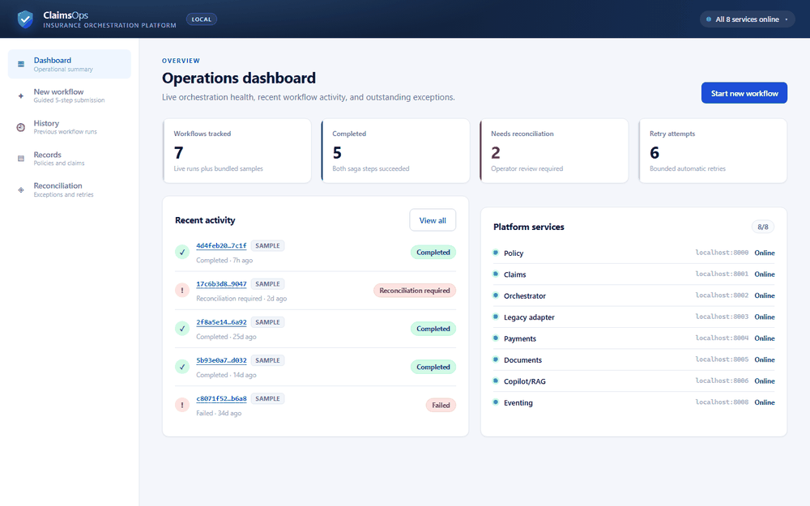

# Demo assets

Reproducible visual evidence for the Operations Console. Everything here is generated by the capture scripts in [`scripts/`](../../scripts) — no asset is hand-edited.

## Walkthrough



## Screenshots

| File | Shows |
| --- | --- |
| `01-dashboard.png` | Operations dashboard: metrics, recent activity, and live platform service health |
| `02-step1-policy.png` | Step 1 — policy and policyholder identification |
| `03-step2-incident.png` | Step 2 — incident date and description |
| `04-step3-assessment.png` | Step 3 — claim amount and adjuster notes |
| `05-step4-review.png` | Step 4 — full payload review before submission |
| `06-step5-result.png` | Step 5 — orchestration result with the saga step timeline |
| `07-history.png` | Workflow history with live and sample runs, plus an inspected workflow |
| `08-records.png` | Policy and claim records for a policyholder |
| `09-reconciliation.png` | Reconciliation queue with failure category and retry action |

## Regenerating

The portal must be served first; downstream service responses are stubbed at the network layer so the recording is deterministic and does not require the full Compose stack.

```sh
cd apps/operations-portal && npm install && npm run dev -- --port 5199
```

Then, from the repository root:

```sh
node scripts/capture-demo.mjs      # screenshots + GIF frames into docs/demo
python scripts/build-demo-gif.py   # assembles operations-portal-demo.gif
```

`scripts/capture-demo.mjs` requires Playwright with Chromium (`npm i playwright && npx playwright install chromium`). `scripts/build-demo-gif.py` requires Pillow (`pip install pillow`). Neither is a runtime dependency of the platform, so both are installed on demand rather than pinned into a service manifest.

Intermediate frames are written to `docs/demo/frames/` and deleted automatically once the GIF is assembled.
